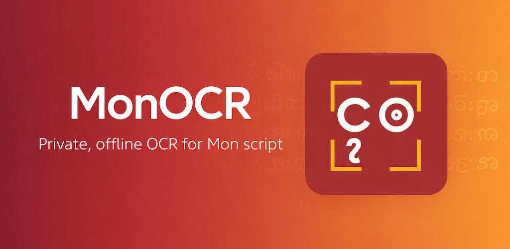

# MonOCR (အင်ဂျင်ဗှ်လိခ်မန်)

[English](README.md) | [မြန်မာဘာသာ](README.my.md) | [ဘာသာမန်](README.mnw.md)

---

ဘာသာမန် ဝွံ ဒုင်ကျောဝ် နကဵုလိုန်ဂၠး တဝှ်ဗ္ဒဲါ ပ္ဍဲဍုင်မန်တိုင်း ကေုာံ ဍုင်တာဲ — [UNESCO ဟီုလဝ် ဒှ်ဘာသာမဒးမင်မွဲ](https://en.wikipedia.org/wiki/Atlas_of_the_World%27s_Languages_in_Danger)။

MonOCR ဝွံ ဒှ်ပရဝ်ဂျေသူ မလ္ပကၠောန်ဒၟံင် ဗိုင်ရီုဒဒှ် ပ္ဍဲကဵု community မန်ရ — ဆိင်ကေတ် ရုပ်ပ္တိုန်လိခ်မန်တုဲ ကဵုဒါန် ဗီုရ (text) ကဵုဒါန်ရ။

---

## Live

- **Web**: [ocr.mondevhub.com](https://ocr.mondevhub.com)
- **Android**: ပ္ဍဲ Google Play ဟွံနွံဏီ — build နူကဵု [`apps/android`](apps/android) ညိ
- **iOS**: ပ္ဍဲ App Store ဟွံနွံဏီ — build နူကဵု [`apps/ios`](apps/ios) ညိ

---

## Model

App ပိ ဂှ် သုင်စောဲဒၟံင် model မွဲဓဝ်ရ၊ ဂှ်ဒှ် **v3.5** ရ-

| | |
| :--- | :--- |
| Architecture | MobileNetV3-Large + SE + 2×BiLSTM-512 + attention + CTC |
| Parameters | 11.55M |
| Input | Grayscale, `160px` အမြင့် |
| Charset | အက္ခရ် 276 |
| Precision | FP32 |
| ပတိတ်လဝ်ပ္ဍဲ | [`janakhpon/monocr`](https://huggingface.co/janakhpon/monocr), revision `d3d9d5e` |

Android ကေုာံ iOS ဂှ် bundle လဝ်ရ (46.2 MB ကေုာံ 46.3 MB)။ Web app ဂှ် နူကဵု revision မပင်လဝ်ဂှ် ဒါန်လုဒ်ရ။ အသေအဓော် app နကဵုမွဲမွဲဂှ် ရံင်ကေတ်ပ္ဍဲ [apps/android](apps/android), [apps/ios](apps/ios) ကေုာံ [apps/web](apps/web) ညိ။

**v3.5 ဂှ် ဟွံဒှ် v2 မတၟိမွဲဓဝ်၊ ဒှ်ကဵု contract တၞဟ်ခြာမွဲရ။** input အမြင့်ဂှ် နူ 128 စဵုကဵု 160၊ output class ဂှ် နူ 316 စဵုကဵု 277၊ အက္ခရ်ဂှ် နူ 315 စဵုကဵု 276၊ graph ဂှ် width axis နူ dynamic စဵုကဵု static 1024 ပြံင်အာရ။ v2 artifact ပ္ဍဲ cache နွံဒၟံင်ဏီဂှ် ဟွံတုပ်ရေင်သကအ်ဗီုဂှ် လိခ်မန်ဗီုပြင်ဒးဒး ဆဂး အဓိပ္ပါယ်ဒးဟွံမွဲဂှ် ကလေင်ကဵုမာန်ဂှ်ရ၊ decode ဟွံကၠောန် ကလေင်ငြင်ဆိုရ။ **v2** ဂှ် မၞိဟ်မပင်လဝ်ကဵုဍေံဂှ် revision `a51be11` ပ္ဍဲဂှ် ဆက်ပတိတ်ဒၟံင်ဖိုဟ်ရ။

Platform မွဲမွဲအတိုင် device latency ဂၞန် ဟွံမွဲရ။

ဟိုတ်နူ dataset အရေဝ်မန် ရှားပါးဒၟံင်ဂှ်ရ validated sample တအ် နူကဵု feedback flow တုဲ ကဵုဗဒှ် training round မဂတဝ်ရ။

---

## Platform

Model ဝွံ ဒှ်ကမၠောန် ပ္ဍဲ Web, Android ကေုာံ iOS ရ-

| Platform | Format | Execution provider requested |
| :--- | :--- | :--- |
| Web | ONNX | WebGPU where the browser offers it, otherwise WASM |
| Android | ONNX | NNAPI, with CPU fallback |
| iOS | CoreML `.mlpackage` | Core ML, all compute units |

- **[Web App](apps/web)** — SvelteKit PWA
- **[Android App](apps/android)** — Jetpack Compose
- **[iOS App](apps/ios)** — SwiftUI
- **[Feedback Service](services/feedback)** — Go ingestion API
- **[Shared Assets](shared)** — locales, API contract, segmentation fixtures

---

## Resources

- **[HuggingFace](https://huggingface.co/janakhpon/monocr)** — ONNX ကေုာံ CoreML ဖိုင်တအ်
- **[npm package](https://www.npmjs.com/package/monocr)** — JavaScript SDK
- **[Architecture decisions](docs/architecture/adr)** — ADRs
- **[API specs](docs/api)** — OpenAPI contracts
- **[Mon Corpus Collection](https://github.com/MonDevHub/MonCorpusCollection)** — training dataset

---

## Contributing

- **တင်တုံ့ပြန်**: [GitHub Issues](https://github.com/MonDevHub/monocr/issues)
- **ဘာသာပြန်တအ်**: ဗိုင်ရီုညိ ပ္ဍဲကဵု [ဘာသာပြန်စာရင်း](https://docs.google.com/spreadsheets/d/1sr8WtiMEyDuDd1amI-wzAz5d2acZlVC7zOZMqixOADQ/edit?usp=sharing)
- **Script samples**: ဗိုင်ပလံင်ညိ ရုပ်လိခ်မန်တအ် နူကဵု Android သာ်ဟွံသေင် iOS App ရ
- **နဲကဲ ပါလုပ်ညိ**: ဗှ်ညိ [Contributing Guide](.github/CONTRIBUTING.md) ကေုာံ [Security Policy](.github/SECURITY.md)

[Janakh Pon](https://github.com/janakhpon) · [Oung Seik Nyan](https://github.com/Oungseik) · [Rajel Da Key](https://www.facebook.com/RJOMDK10) · [MonDevHub](https://github.com/MonDevHub)

## Licence

[MIT](LICENSE)
