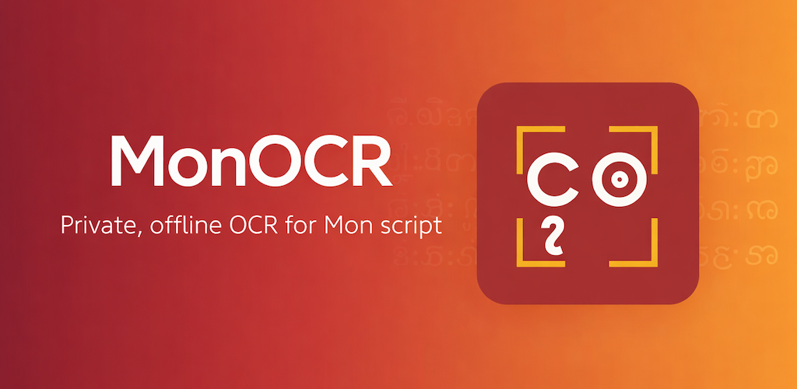

# မွန် OCR (MonOCR)

[English](README.md) | [မြန်မာဘာသာ](README.my.md) | [ဘာသာမန်](README.mnw.md)

---

မွန်ဘာသာစကားကို လူဦးရေ တစ်သန်းခန့်က မြန်မာနိုင်ငံနှင့် ထိုင်းနိုင်ငံတို့တွင် ပြောဆိုသုံးစွဲသည်။ [UNESCO မှ ထိန်းသိမ်းရန်လိုအပ်သောဘာသာ](https://en.wikipedia.org/wiki/Atlas_of_the_World%27s_Languages_in_Danger) အဖြစ် သတ်မှတ်ထားပြီး ဤပရောဂျက်မတိုင်မီ မွန်ဘာသာစကားအတွက် OCR ကိရိယာဆောင်ရွက်မှုမရှိသေးပါ။

MonOCR သည် မွန်အက္ခရာ ပုံရိပ်ကိုယူ၍ စာသားထုတ်ပေးသည်။ Web၊ Android နှင့် iOS တို့တွင် အလုပ်လုပ်သည် — အပြည့်အဝ offline၊ ဒေတာသည် စက်မှထွက်ခွာမည်မဟုတ်ပါ။

မွန်ဖွံ့ဖြိုးရေး လူ့အဖွဲ့အစည်းမှ တည်ဆောက်ထိန်းသိမ်းသည်။

---

## Live

- **Web**: [ocr.mondevhub.com](https://ocr.mondevhub.com)
- **Android**: [Google Play](https://play.google.com/store/apps/details?id=dev.janakhpon.monocr)
- **iOS**: [App Store](https://apps.apple.com/app/monocr) *(ပြန်လည်စစ်ဆေးဆဲ)*

---

## Models

Model နှစ်မျိုးကို တက်ကြွစွာ လေ့ကျင့်ထိန်းသိမ်းနေသည်-

| | **v3.5 — Mobile** | **v4 — Server** |
| :--- | :--- | :--- |
| ရည်ရွယ်ချက် | On-device / edge | Server-side / စာရွက်စာတမ်း |
| Architecture | MobileNetV3 + 2×BiLSTM(512) + CTC | Swin-T Encoder + 6-layer Transformer Decoder |
| Parameters | 11.4M | ~54M |
| Input | Grayscale, `160px` အမြင့် | RGB, `224×1024px` |
| Export | ONNX FP32/FP16/INT8 · CoreML | ONNX သာ |
| Inference (CPU) | ~30ms/line | ~180ms/line |

mobile model (v3.5) သည် Web (WASM)၊ Android (NNAPI) နှင့် iOS (Core ML) တို့တွင် on-device လုပ်ဆောင်သည်။ server model (v4) သည် အရောင်ပတ်ဝန်းကျင်နှင့် ရှည်လျားသောစာသားပါဝင်သည့် ရှုပ်ထွေးသောစာရွက်ပုံရိပ်များကို ကိုင်တွယ်သည်။

မွန်ဘာသာ dataset အရည်အသွေးမြင့်များ ရှားပါးသောကြောင့် application ၏ feedback flow မှ validated sample များသည် နောင်လေ့ကျင့်ရေးဆောင်ရွက်မှုများထဲသို့ တိုက်ရိုက်ဝင်ရောက်သည်။

---

## Platform

mobile model (v3.5) သည် Web၊ Android နှင့် iOS တို့သို့ တပ်ဆင်သည် — hardware acceleration ဖွင့်ပေးသောပုံစံကို အသီးသီးအသုံးပြုသည်-

| Platform | Format | Acceleration |
| :--- | :--- | :--- |
| Web | ONNX | WASM |
| Android | ONNX | NNAPI |
| iOS | CoreML `.mlpackage` | Apple Neural Engine |

- **[Web App](apps/web)** — SvelteKit PWA
- **[Android App](apps/android)** — Jetpack Compose
- **[iOS App](apps/ios)** — SwiftUI
- **[Feedback Service](services/feedback)** — Go ingestion API
- **[Shared Assets](shared)** — model weights, locales, sync scripts

---

## Resources

- **[HuggingFace](https://huggingface.co/janakhpon/monocr)** — ONNX, CoreML နှင့် checkpoint ဖိုင်များ
- **[npm package](https://www.npmjs.com/package/monocr)** — JavaScript SDK
- **[Architecture decisions](docs/architecture/adr)** — ADRs
- **[API specs](docs/api)** — OpenAPI contracts
- **[Mon Corpus Collection](https://github.com/MonDevHub/MonCorpusCollection)** — training dataset

---

## Contributing

- **Bugs**: [GitHub Issues](https://github.com/MonDevHub/monocr/issues)
- **ဘာသာပြန်ချက်များ**: [Shared translation sheet](https://docs.google.com/spreadsheets/d/1sr8WtiMEyDuDd1amI-wzAz5d2acZlVC7zOZMqixOADQ/edit?usp=sharing)
- **Script samples**: Android သို့မဟုတ် iOS app မှတစ်ဆင့် ပါဝင်ကူညီပါ သို့မဟုတ် တိုက်ရိုက်ဆက်သွယ်ပါ
- **Standards**: [Contributing Guide](.github/CONTRIBUTING.md) · [Security Policy](.github/SECURITY.md)

[Janakh Pon](https://github.com/janakhpon) · [Oung Seik Nyan](https://github.com/Oungseik) · [Rajel Da Key](https://www.facebook.com/RJOMDK10) · [MonDevHub](https://github.com/MonDevHub)
